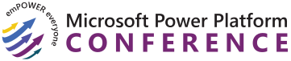

# 🔌 Build, Deploy, and Scale Power Apps

> [!NOTE]
> This repository is for the "Build, Deploy, and Scale Power Apps!" workshop at the Microsoft Power Platform Conference on Monday the 2nd of October 2023 in Las Vegas.

## 📝 Workshop description

Learn how to build and deploy Power Apps for enterprise scale across your organization. For more advanced makers and developers, you'll get hands-on experience with the full application lifecycle: from setting up your tenant with the right guardrails, development best practices to ensure your apps run performantly, deploying your work using the newest AI-powered pipelines ALM capabilities, and ensuring all this is easily governable.

## 🚀 Labs

The labs are as follows:

- [Lab 01: Setup and configure](./lab1/README.md)
- [Lab 02: Develop](./lab2/README.md)
- [Lab 03: Deploy](./lab3/README.md)
- [Lab 04: Enterprise Scale](./lab4/README.md)

## ™️ Trademarks

This project may contain trademarks or logos for projects, products, or services. Authorized use of Microsoft
trademarks or logos is subject to and must follow
[Microsoft's Trademark & Brand Guidelines](https://www.microsoft.com/legal/intellectualproperty/trademarks/usage/general).
Use of Microsoft trademarks or logos in modified versions of this project must not cause confusion or imply Microsoft sponsorship.
Any use of third-party trademarks or logos are subject to those third-party's policies.
