# 🚀 Lab 1: Setup and configure

Before we start with the lab, there are a couple of things we want you to be aware of:

1. You can find the credentials you are going to use for this workshop in the **Environment Details** tab above the instructions
1. Every time you see a link to a website, make sure to copy the link and paste it into the address bar in your browser in the lab environment. If you don't do this, the links will open in your laptop browser instead
1. When you log into your account, you might see the following image. Make sure to always select **Ask later**

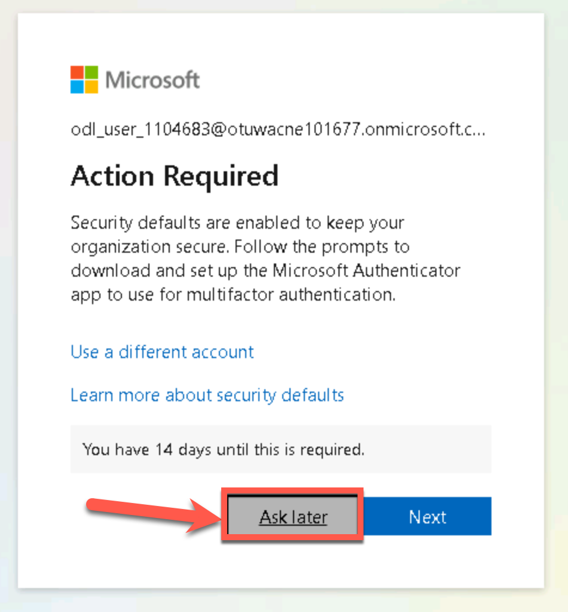

## Lab 1 - Tasks

In this lab, you will go though the following tasks:

- Log on to your account
- Create a GitHub account
- Create a fork of the repository for this workshop
- Creating a GitHub Codespace
- Connect to the Power Platform using the Power Platform Command-Line Interface (CLI)
- Create developer environments
- Switch between environments with the Power Platform CLI
- Enable Managed Environments on all environments
- Deploy the pipelines solution to your Prod environment
- Enable Dataverse settings

## Task 1: Log on to your account

With the credentials that were provided to you in the **Environment Details** tab, let's log into the account you are going to use during the workshop.

1. Go to [make.powerapps.com](https://make.powerapps.com)
1. On the sign-in screen, enter the email address that was provided to you in the **Environment Details** and then click **Next**

    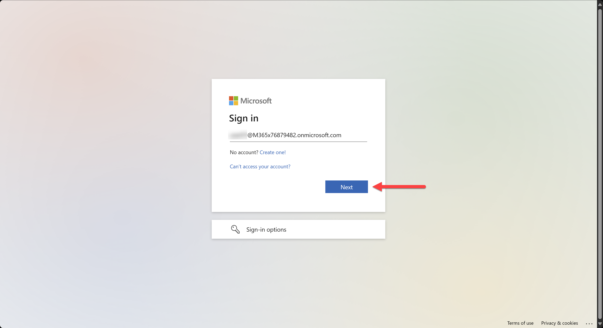

1. Then enter the password and click **Sign in**
    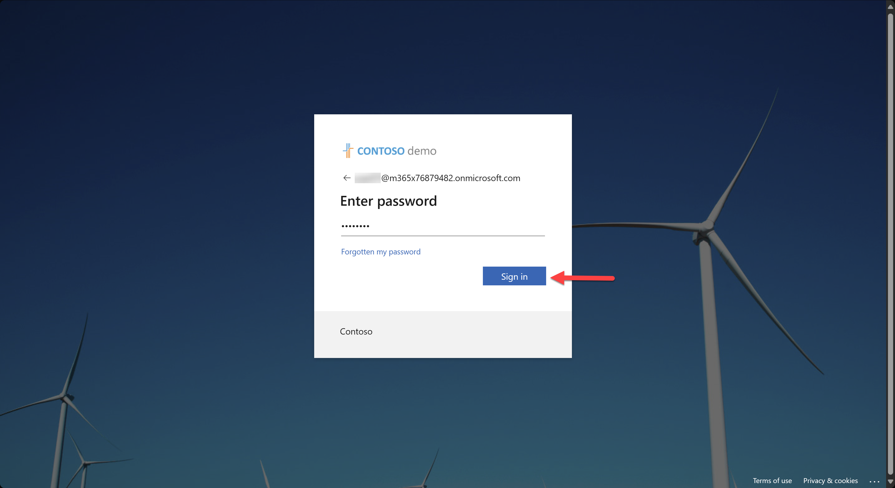

1. If you're prompted to stay signed in, click **Yes**

    You should now be logged in and on the Power Apps Home Page.

    

## Task 2: Create a GitHub account

For this workshop, we are going to be using GitHub.

1. Go to the [GitHub](https://github.com) website
1. Click on **Sign up** on the top right corner
1. Enter your email address (use the email address for this workshop) and then click **Continue**
1. Create a password and then click **Continue**
1. Enter a username and then click **Continue** (this is a username you're going to use only for this workshop, so don't pick something you want to use later)
1. Select whether you want to receive product updates or not and then click **Continue**
1. Solve the puzzle to verify your account and then click **Create account**
1. Go to [Outlook for the web](https://outlook.office.com) in a new tab
1. Open the email that was sent to you from GitHub and copy the code
1. Enter the code that was sent to your email address on the GitHub website. This should lead you to your dashboard where you can create a repository, but that's not what we're going to do now

You now have a GitHub account. Welcome to the community!

## Task 3: Create a fork of the repository for this workshop

Now that you have a GitHub account, we are going to create a fork of the repository for this workshop. A fork is a copy of an existing repository. Forking a repository allows you to freely experiment with changes without affecting the original project.

1. Go to the [MPPC23-Power-Apps](https://aka.ms/MPPC23-Power-Apps) GitHub repository
1. Click on the **Fork** button on the top right corner

    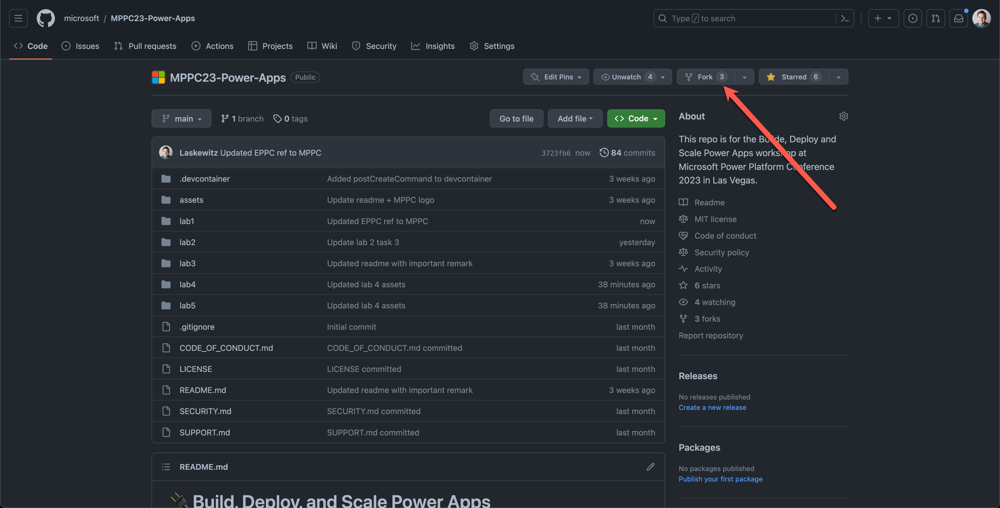

1. Once the "Create a new fork" page opens, review the information and then click **Create Fork**

    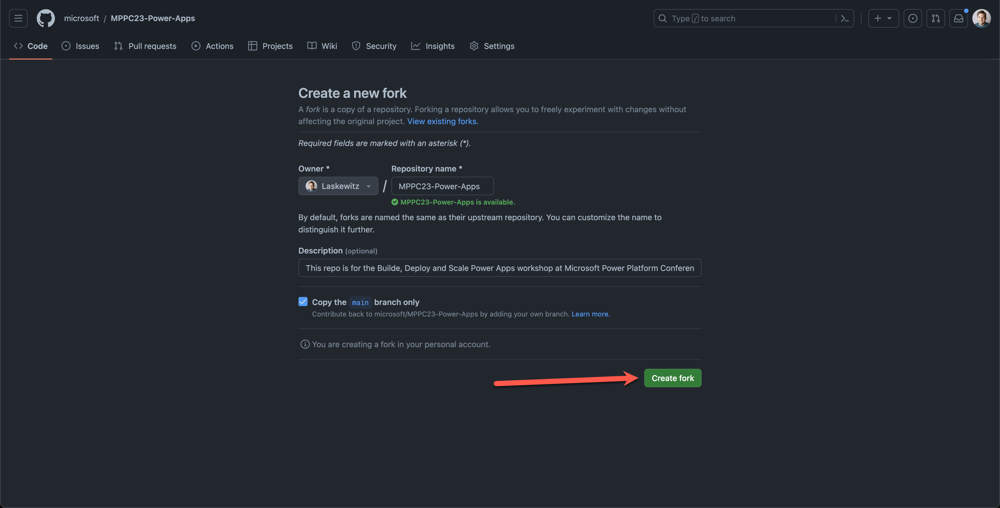

    Once your have created the fork, you will be redirected to your forked repository. You can see that you are in your forked repository by looking at the top left corner of the page. It should say **MPPC23-Power-Apps forked from microsoft/MPPC23-Power-Apps**.

## Task 4: Create a GitHub Codespace

A codespace is a cloud-hosted development environment you can access from anywhere. It has everything you need, including a text editor, terminal, and debugger. Codespaces are powered by Visual Studio Code and run in a containerized environment. For this workshop, we are going to use codespaces to do our development.

1. Make sure that you are in your forked repository (_your-username/MPPC23-Power-Apps_) and then find and click on the **<> Code** button

    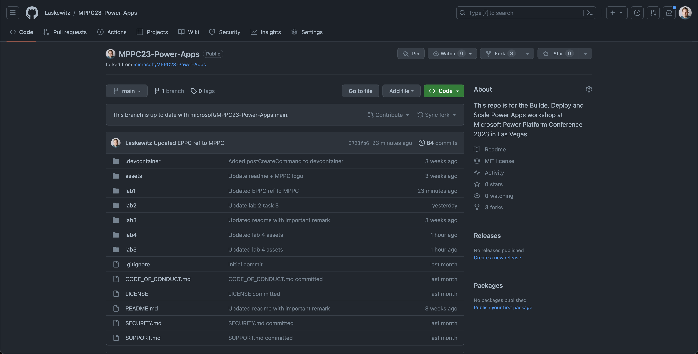

1. On the **Code** pop up, select the **Codespaces** tab
1. Click **Create codespace on main**

    A codespace will now be created for you in a new tab. This will take a few seconds. But once it's done, you will have a fully functional Visual Studio Code environment in your browser. You can now start developing!

## Task 5: Connect to the Power Platform using the Power Platform Command-Line Interface (CLI)

1. In your codespace, click on the **Power Platform** icon in the left navigation

    

    You'll more than likely see that there is "No auth profiles found on this computer". Let's create one.

    

1. If you don't see it open already, let's open the Terminal. Click on the Burger menu icon in the top left corner and then hover over **Terminal** and then click **New Terminal**

    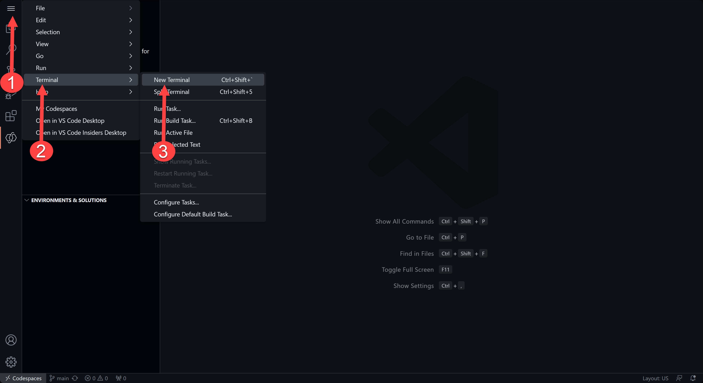

    A terminal window has now been opened for you. This is where you will write all of the following commands in this lab and in the upcoming labs as well.

1. Type the following command in the terminal and then press **Enter**:

    ```bash
    pac auth create --deviceCode
    ```

1. You will be prompted to use a web browser to authenticate. Copy (**ctrl + c**) the ```code``` that is provided in the terminal and then **Ctrl + click** on the link that is provided in the terminal.

    

    Once you click on that link, it will open a new browser tab where you will have to paste that code into the browser and then click **Next**

    > **Note:** 
    > If you are using a Mac, you can **Ctrl + click** on the ```link``` that is provided in the terminal and then enter the ``code`` provided.

    

1. Pick the account that was provided to you. If you can't see it on screen then log in.

    

1. Then type in your password and click **Sign in**

    You will then see a page asking if you're trying to sign in to Power Platform CLI - pac.

    

1. Click **Continue**

    You'll then see a prompt confirming that you have successfully signed in to Power Platform CLI - pac. Close the browser tab and return to your codespace.

1. Refresh the Auth Profiles section by clicking on the **Refresh** button next to "Auth Profiles"

    

    You should now see at least one auth profile. If you have more than one, you can select the one you want to use by clicking on the **Select Auth Profile** button next to the auth profile.

    

## Task 6: Create developer environments

Developer environments are very helpful when you want to try out features, they are meant to be short living environments.

For this workshop, we are going to create three different developer environments:

- ```Dev```: The environment where we are going to create our app and solution later on.
- ```QA```: The environment where we are going to deploy our solution to in a later lab.
- ```Prod```: The environment where we are going to deploy our solution to in a later lab.

To create developer environments, you can create them in multiple ways:

1. By subscribing to the Power Apps Developer Plan
1. Via the Power Platform Admin Center (PPAC)
1. Via the Power Platform CLI

> **Note:**
> When subscribing to the developer plan, you will automatically assign a developer license to yourself. When creating a developer environment through PPAC or the CLI, you will not do that. That's why we do this step first, so that you won't have to start a trial.

In this workshop, we will create one environment through the UI, one via PPAC, and the last one via the CLI, so that you know all about how to create developer environments.

### Create the 'Dev` environment by subscribing to the developer plan

Currently, if you want to get all that the Power Platform offers, it's required to subscribe to the Power Apps Developer Plan. In this part, we will walk you through all the steps:

1. Go to the [Power Apps Developer Plan](https://aka.ms/pp/devplan) website
1. Select the **Existing user? Add a dev environment** button

    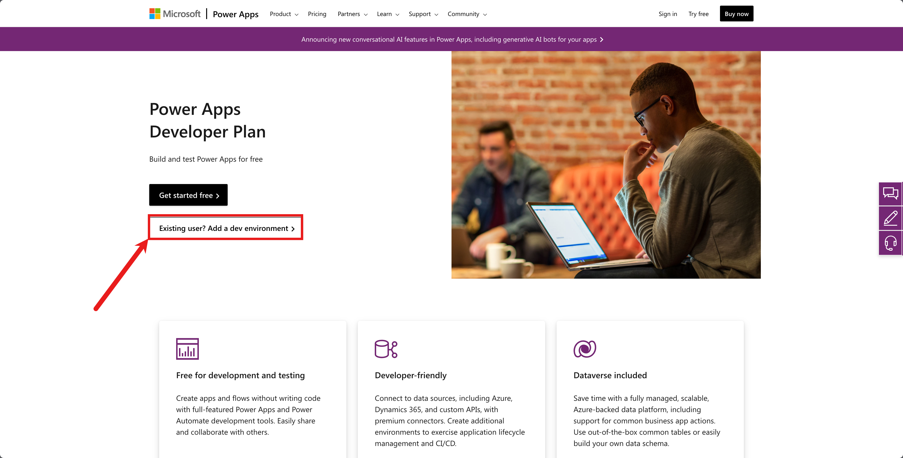

1. Select the **Sign up for a Community Plan** link

    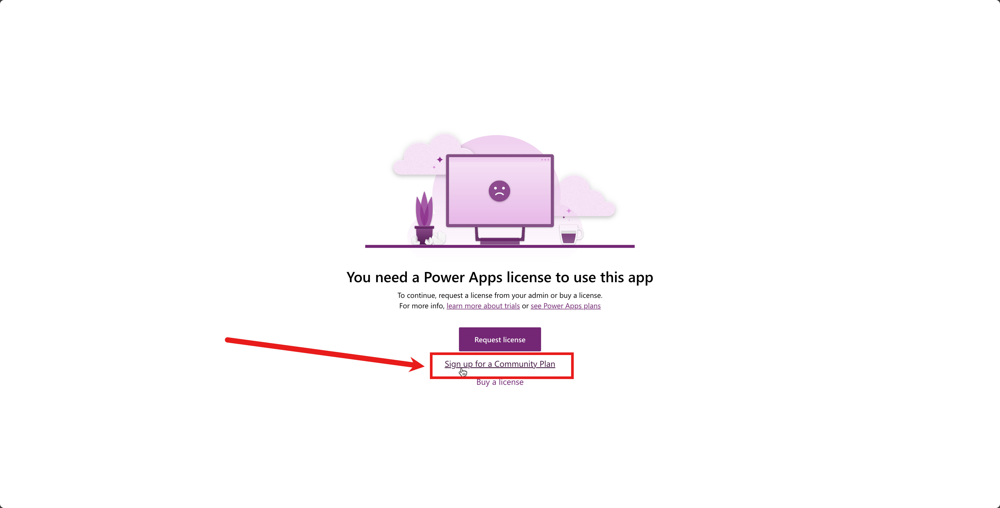

1. Leave the country on United States and select the **Accept** button.

    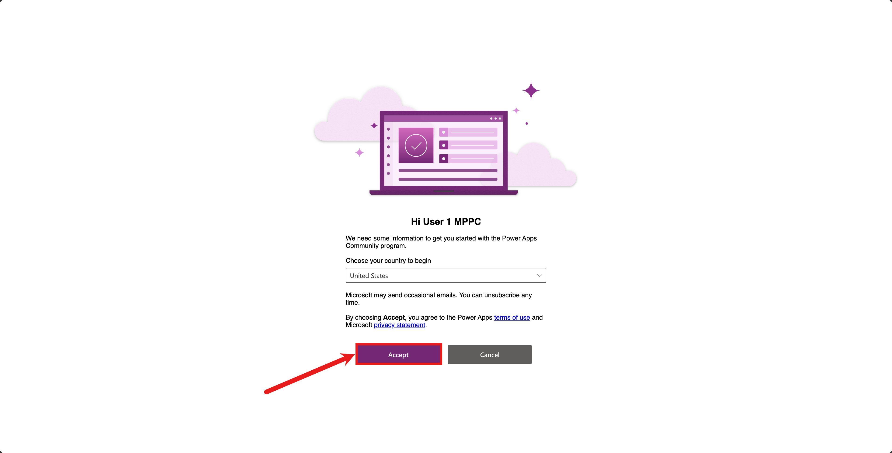

1. After selecting **Accept**, a Power Platform developer environment will be created for you with the name `{User}'s Environment` and you will be redirected to the maker portal. In here, you will see two things:
    1. The environment picker at the top-right with your recently created environment `{User}'s Environment` selected

    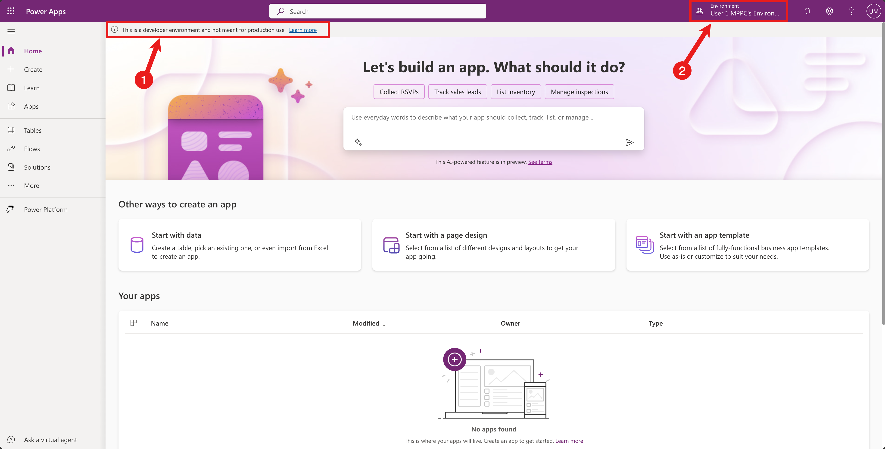

Now, let's rename the environment to something that makes sense to us.

1. Go to the [Power Platform Admin Center](https://aka.ms/ppac)
1. Exit the Welcome / Tour pop up. You can do this by clicking on the **X** in the top right corner of the pop up screen

    

1. Select **Environments** in the left navigation
1. Select `{User}'s Environment` by clicking on the name
1. In the details card, select **edit**

    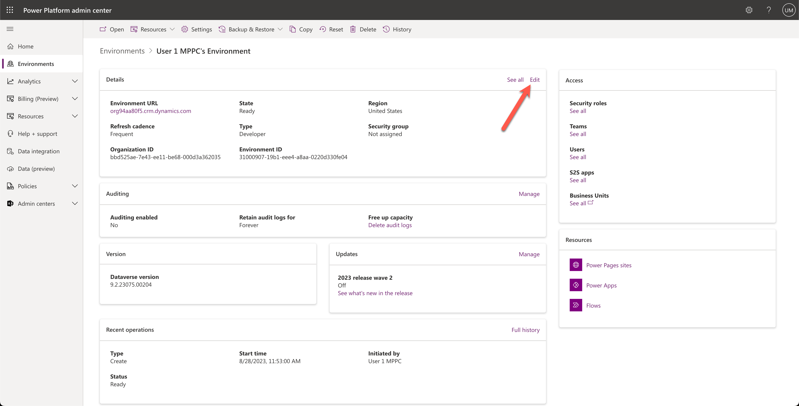

1. In the side panel, make sure to change the **Name** to `Dev` and select the **Save** button.

    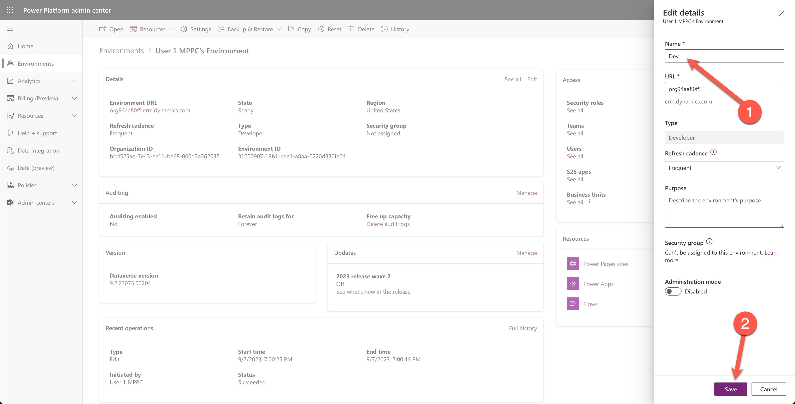

    This will trigger a name change, and will lead you to the following screen.

    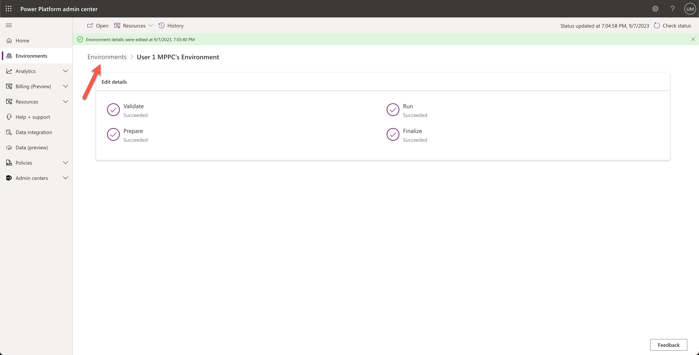

1. Select **Environments** to make get back to the overview of the environments.

### Create the `QA` environment via the Power Platform Admin Center (PPAC)

We are going to create a QA environment through the Power Platform Admin Center.

1. Select **New** in the top navigation

    

1. When the right-hand side dialog pops up - enter the following information:

    | Field | Value |
    | --- | --- |
    | Name | QA |
    | Region | US - Default |
    | Type | Developer |
    | Purpose | Developer environment for MPPC23 |

    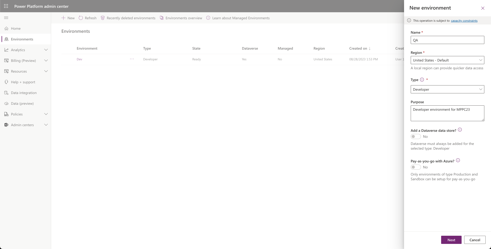

1. Select **Next**
1. The next section is asking you to add Dataverse. Finally select on **Save**

### Create the `Prod` environment via the Power Platform Command-Line Interface (CLI)

We will create the last environment we are going to create via the Power Platform CLI. Because we don't have to go through the UI, and we don't have to load anything, this will go way faster than the other options.

We will create the last environment with the following values:

| Field | Value |
| --- | --- |
| Name | Prod |
| Region | US - Default |
| Type | Developer |

The command we need to use for creating an environment is `pac admin create`. The documentation of this command can be found [here](https://aka.ms/pac/admin/#pac-admin-create).

Run the following command in the terminal in your codespace:

```bash
pac admin create --name "Prod" --type "Developer"
```

> **Note:**
> We don't use `purpose` here, because the Power Platform CLI doesn't have a parameter for this. Also, we are using the defaults for `region` and `currency`, so we don't have to add those to the command.

Once you have created all three environments, you should see them in the list of environments. Click the **Refresh** button on the top navigation if you don't see them yet.

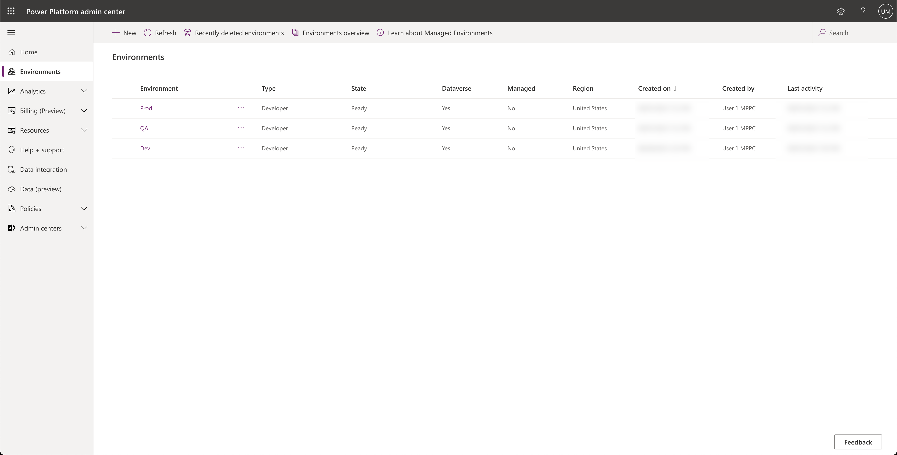

## Task 7: Switch between environments with the Power Platform CLI

1. With the correct Auth Profile, in the terminal type the following command and then press **Enter**:

    ```bash
    pac org list
    ```

    This gets a list of all the environments that you have access to. You should see the **Dev** environment listed as one of them. This is the one we want to eventually connect to.

    > **Note:** 
    > It can take a couple of minutes before you get the full list of environments. Run the command again every minute until you see all the environments.    

    

1. Take note of the Environment ID of the **Dev** Environment and copy it.

    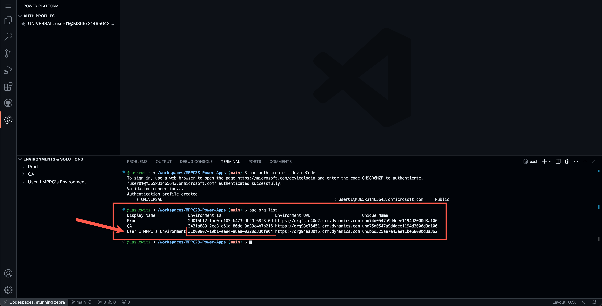

1. Then in the terminal, type the following command and then press **Enter**. Make sure to replace ```00000000-0000-0000-0000-000000000000``` with the environment id that you copied above

    ```bash
    pac org select --environment 00000000-0000-0000-0000-000000000000
    ```

    You should then see confirmation that you have successfully selected the **Dev** org for the current auth profile.

    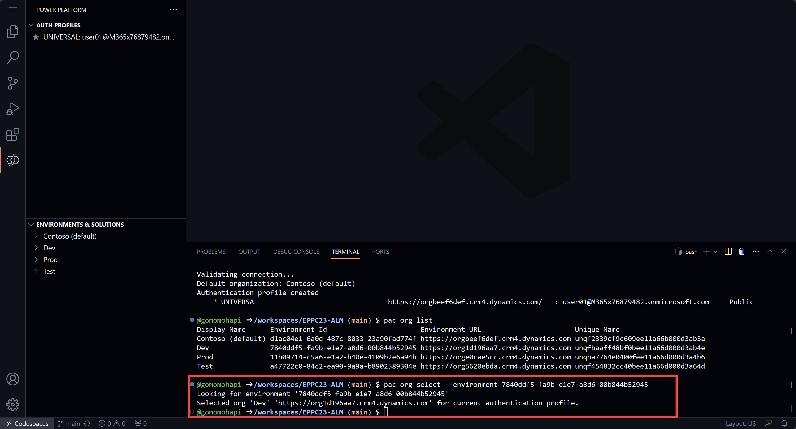

1. To have further confirmation that you have successfully connected to the **Dev** environment, in the terminal type the following command and then press **Enter**:

    ```bash
    pac org who
    ```

    This command will return information about the environment that you are connected to. You should see the **Dev** environment listed as well as other unique information about the environment including the User email you're connected as.

    

## Task 8: Enable Managed Environments on all environments

In this task, you will learn how to enable Managed Environments on all environments you just created.

1. Go back to the [Power Platform Admin Center](https://aka.ms/ppac)

1. Select **Environments** in the left navigation

1. Use the **search box** in the top-right corner to **search** for all environments created by your user

    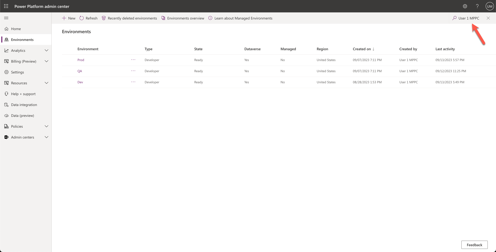

1. Select **Dev** and select the **Enable Managed Environments** button at the top (it could be hidden under the ... overflow menu)

    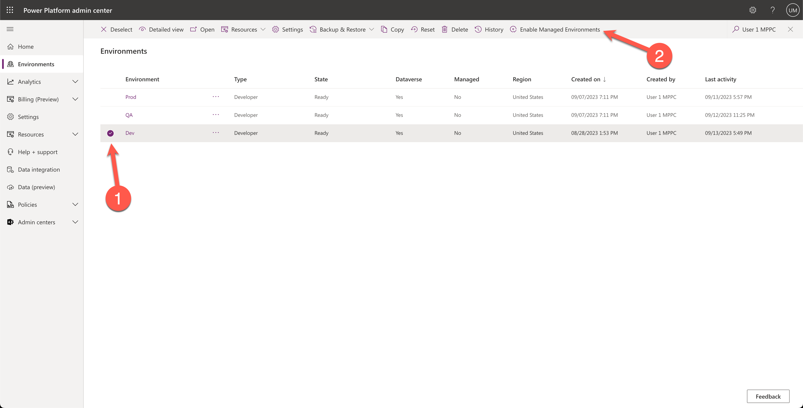

    Make sure you look at the highlighted text about licensing. After enabling an environment as a Managed Environment, everyone in that environment has to have a premium license

    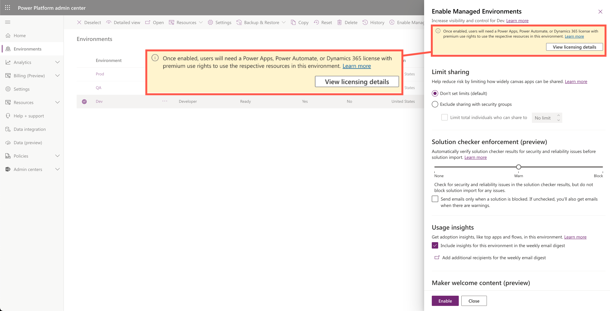

1. Select the purple **Enable** button

    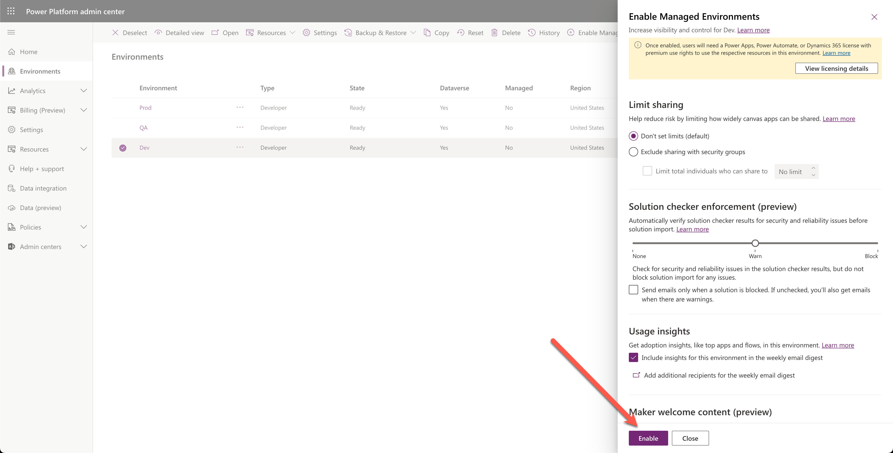

1. **Repeat steps 3-5** for both the QA and Prod environments

1. If all went well, you should see **Yes** in the **Managed** column at all three environments

    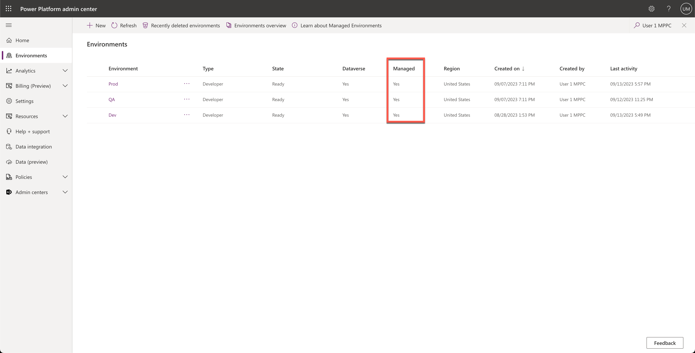

## Task 9: Deploy the pipelines solution to your Prod environment

In this task, you will learn how to install the pipelines for Power Platform solution in your `Prod` environment. This solution is needed to configure pipelines.

> **NOTE:**  
> Normally, it's a best practice to install the pipelines solution on a separate "Pipelines Host" environment. In this lab, you will install it in the `Prod` environment because a you can have three **free** developer environments, so you don't have space for another `Pipelines Host` environment next to `Dev`, `QA`, and `Prod` environments.
>
> This is a best practice because you will avoid people accidentally using dependencies on the pipelines tables, or having issues with sharing pipelines and giving people the right security roles. Take a look at the [FAQ on Microsoft Learn](https://learn.microsoft.com/power-platform/alm/pipelines#frequently-asked-questions) to learn more best practices.

There are two ways to install the pipelines solution:

### Via Power Platform Admin Center

1. Go to the [Power Platform Admin Center](https://aka.ms/ppac)

    

1. Select the **Prod** environment you created before

1. In the command bar at the top (make sure you use the button at the top and don't use the left navigation - which also has a resources button), select **Resources** and **Dynamics 365 apps**

    

1. Here you can find the apps that are installed on your `Prod` environment by default. Select the **Install App** button in the command bar at the top

    

1. In the sidebar that opens, scroll all the way down select the **Power Platform Pipelines** app and select the **Next** button at the bottom of the sidebar

    

1. Next, make sure to agree to the terms and select the **Install** button at the bottom of the sidebar

    

This process will take a couple of minutes, you can refresh the page by selecting the **Refresh** button in the command bar at the top.

When finished, you can go to the [maker portal](https://make.powerapps.com) and select the right environment (`Prod`). If all went well, you should be able to see the `Deployment Pipeline Configuration` app in the Apps section in the maker portal.

### Via Power Platform CLI

1. Open up your Codespace.

1. Open a new terminal by selecting the **Hamburger Menu > Terminal > New Terminal**

    

1. Open the Power Platform Tools VS Code Extension by selecting the Power Platform DevTools icon on the left, make sure you see the `Prod` environment in the Environments & Solutions panel and select the empty star behind it to select the right environment.

    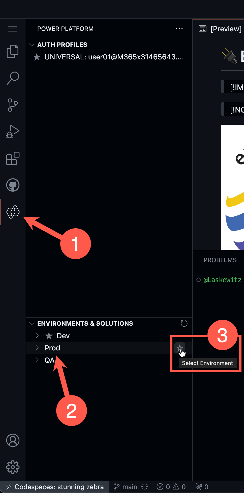

1. Enter the following command:

    ```bash
    pac application list
    ```

    This command will return all the applications that you can install with the `pac application install` command.

    Zoomed in and highlighted is the unique name of the `Power Platform Pipelines` application: `msdyn_AppDeploymentAnchor`.

    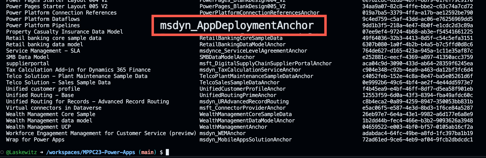

1. Now we can install the `Power Platform Pipelines` application by using the following command:

    ```bash
    pac application install --application-name msdyn_AppDeploymentAnchor
    ```

    This command will return all the applications that you can install with the `pac application install` command.

## Task 10: Enable Dataverse settings

A recent addition to the Power Platform CLI is the ability to list and update Dataverse settings. This means that you can change the settings that are normally only available through the UI. In this task, you will learn how to change the settings.

### List Dataverse settings

1. Make sure to run the `pac org who` command to make sure you are in the `Dev` environment
    If not, make sure to switch there, using the pac org select command like we did in task 7
1. Run the following command and then press **Enter**:

    ```bash
    pac org list-settings
    ```

    This command will return all the settings in the org we are connected to now (the `Dev` environment). As you can see, this is a very large list. You can filter them though.

1. Add the `--filter` parameter and filter for all settings that contain `audit` with the following command:

    ```bash
    pac org list-settings --filter audit
    ```

    This command will return all the settings that contain `audit` in the org we are connected to now (the `Dev` environment). As you can see, this is a way smaller list than what we saw before.

    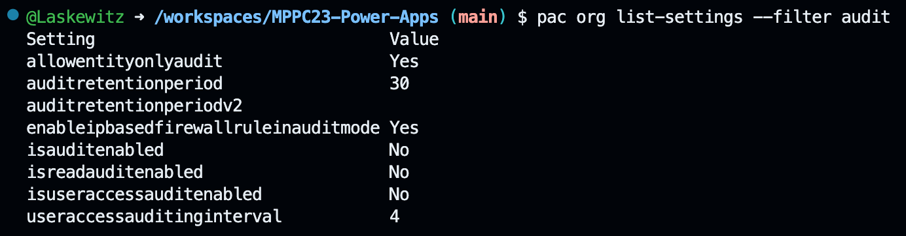

### Update Dataverse settings

Let's try out how updating a setting works. In the list of audit settings we just saw, there is a `isauditenabled` setting which is set to **No**.

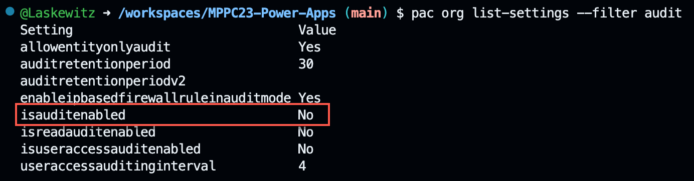

1. Run the following command and then select **Enter**:

    ```bash
    pac org update-settings --name isauditenabled --value true
    ```

    This command will set the `isauditenabled` setting to true.

    > **Note:** 
    > Note that the list command showed `No` as the output, but for updating you need to use true or false.

1. Run the following command again to verify if the setting is applied and select **Enter**:

    ```bash
    pac org list-settings --filter audit
    ```

    This command will return all the settings that contain `audit` in the org we are connected to now (the `Dev` environment). As you can see, the `isauditenabled` setting is now set to `No`.

    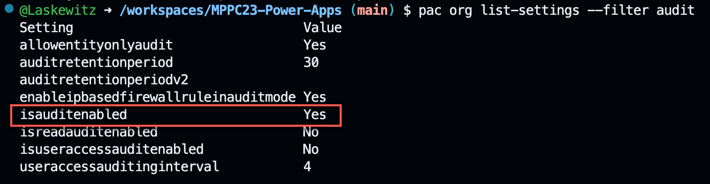

## Next lab

This is the end of lab 1. Select the second page below to move to the next lab.
