# 🚀 Lab 2: Develop

## 📝 Lab 2 - Tasks

In this lab, you will go though the following tasks:

- Creating A Canvas App With Data From An Excel-File
- Creating A Canvas App With Power Apps Copilot
- Creating A Solution
- Add The Resources Created By Power Apps Copilot To A Solution

## ☑️ Task 1: Create A Canvas App With Data From An Excel-File

In this task, you will:

- Create a Canvas App using Excel to App
- Customize galleries by using Power Apps Ideas to generate Power Fx formulas

### Introduction To Excel To App

With Excel to App, you'll select an Excel file, create an app, and then run the app that you create. Every app created includes screens to browse records, show record details, and create or update records. By generating an app, you can quickly get a working app using Excel data, and then you can customize the app to better suit your needs.

When you upload an Excel file it generates a Dataverse table. With Dataverse's standard and custom tables, you can securely store your data in the cloud. These tables enable you to define your organization's data in a way that is tailored to your business needs, making it easier to use within your apps.

If your environment is in the US region and AI is enabled in your organization, the AI Copilot feature can assist in table creation by suggesting table names, descriptions, column data types, and headers, even if this information is missing from the uploaded file. When Copilot AI is used for table creation, the Copilot card is displayed to indicate that the table was generated by Copilot AI.

In this task, you’ll create an application with data from an Excel table.

> **Note:**
>
> Power Apps requires either a Microsoft 365 license or a free trial. Learn more about your licensing options. [Microsoft products include Microsoft Power Apps and Power Automate](https://learn.microsoft.com/power-platform/admin/pricing-billing-skus).

### Explore The Excel To Power App Functionality

1. Go to [make.powerapps.com](https://make.powerapps.com/) and Sign In with your Power Apps credentials.

1. From the Power Apps home screen, select Start with data.

    

1. Then select Upload an Excel file.

    

1. Click Select from device and navigate to the location `C:\LabFiles` where the RealEstateProperties.xlsx Excel file is saved and upload it. The maximum file size limit is 5 GB.

    

1. A table which is based on the data from the RealEstateProperties.xlsx Excel file will be generated. Click the pencil edit icon next to the table name to change it.

    

1. On the Edit Table pop up, enter Real Estate Property as the Display name, Real Estate Properties as the Plural Name, and make sure that Address is selected as the Primary column. Select Save.

    

1. Select the Create app button on the bottom right-hand corner of the screen.

    

1. When the app first loads, a dialog may appear saying: Welcome to Power Apps Studio. If so, select the Skip button.

1. You should now be viewing the app that has been generated for you in Edit mode.

    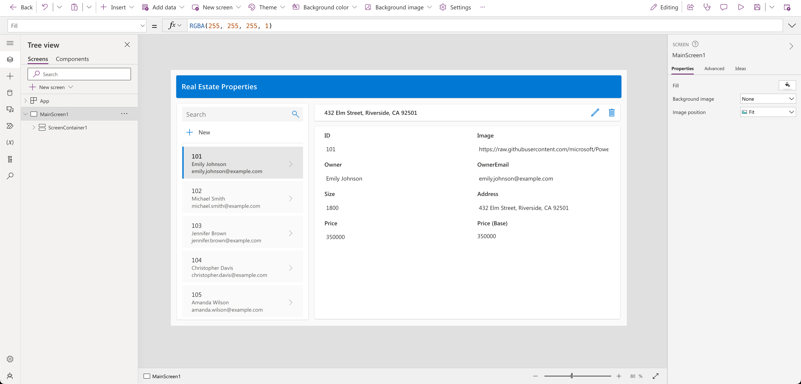

1. To the left of the screen, select the Data icon from the navigation bar. Notice that a Dataverse table, based on the RealEstateProperties.xlsx Excel file, has been created.

    

1. Select the Tree view icon to return to the Tree view.

    

1. On the app main screen, click on the gallery displaying the Real Estate Properties and then click on RecordsGallery1 in the Tree view to expand it.

    

1. Select the ellipsis (…) next to the NextArrow and delete it.

    

1. Select the RecordsGallery1 and then select the edit button to put the gallery in edit mode.

    

1. Reduce the width and move the position of the Title component so that it is towards the right-hand side of the template cell.

    

    The other components should reposition alongside the Title component. If not, then move them until it looks like the screenshot above.

1. Make sure that the gallery is still in edit mode. Select the Title.

1. Make sure that the Text value of the Title component is set to the following formula:

    `ThisItem.Address`

    

1. Now select the Subtitle component in the gallery.

1. Set the Text value of the Subtitle to the following formula:

    `ThisItem.Size`

1. Using the tool bar at the top of the page, change the Size to 13.

    

1. Finally, select the Body component in the gallery.

1. Set the Text value of the Body to the following formula:

    `ThisItem.Price`

1. Your gallery should now look like this:

    

1. Select the RecordsGallery1 and then select the edit button to put the gallery in edit mode. Then click on Insert > search for Image > and then select the Image component.

    

1. The image will then be added to your gallery. Reposition and resize the image so that it is in the center of each gallery cell.

    

1. Now to use Power Apps Ideas. Make sure the gallery is still in edit mode. And select the gallery body containing the Price. Then select the **arrow** next to the Copilot icon which appears above it. Next, select **Text formatting**.

    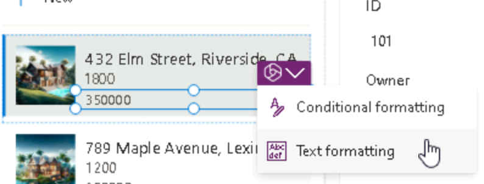

1. Enter this output in the Desired format text box:

    `$350,000`

    Then press Enter.

    

1. Select the generated formula. Then select Apply.

    

    With Power Apps Ideas, the example \($350,000\) which you gave generated a formula:

     `(Text(ThisItem.Price, "$#,##0", "en-US"))` which is now updated in the formula bar for the Price gallery control.

1. Now let’s do the same for the Size control in the subtitle of the gallery. Make sure the gallery is in edit mode. And select the subtitle containing the Size. Then select the **arrow** next to the Copilot icon which appears above it. Next, select **Text formatting**.

1. Enter this output in the Desired format text box:

    `Size: 1,800 sq ft`

    Then press Enter.

    You may notice that the ideas section is empty. This may be caused by the lack of information or context required to generate a formula.

    

1. So, let’s add more examples. Click + Add examples at least 2 more times.

    

1. Select 2 Current formats and then provide 2 corresponding Desired formats.

    

1. With the added context, Power Apps Ideas now generates a suitable formula for you:

    

1. Select the generated formula. Then select Apply.

    Your gallery should now be looking like this:

    

1. Save the app.

1. Publish the app by clicking the publish icon in the top right corner

    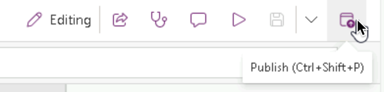

1. Here you will see a dialog appear where you can add a description to your app. It also enables you to generate one using AI. Select the **Create description using AI** button

    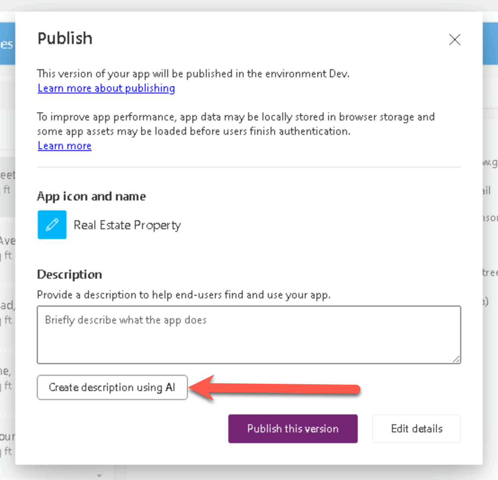

1. Check if the description is correct. If not, correct it and select the **Publish this version** button. If yes, select the **Publish this version** button.

    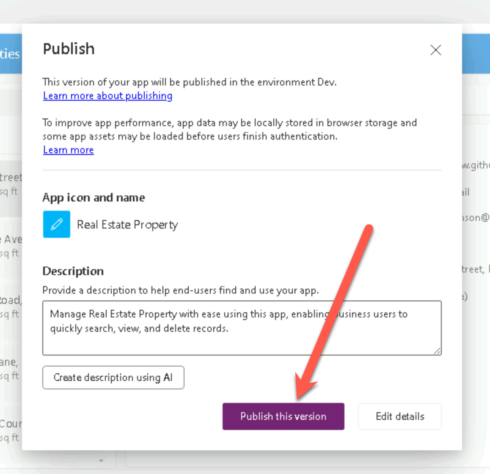

1. Exit the app to return to the Power Apps home page.

    

## ☑️ Task 2: Create a Canvas App with Power Apps Copilot

In this task, you’ll create an application leveraging Power Apps Copilot.  This app will be used by field agents to browse real estate inventory and manage appointments for showings and the data will be stored in Dataverse.

> **Note:**
> Power Apps requires either a Microsoft 365 license or a free trial. Learn more about your licensing options. [Microsoft products include Microsoft Power Apps and Power Automate](https://learn.microsoft.com/power-apps/administrator/pricing-billing-skus/).

### Explore AI Copilot within Power Apps

> **Note:**
>
> Within this lab, notice that your results for data may vary from those within the screenshots and images throughout the lab. This is because Power Apps is using OpenAI to generate data for the lab that changes daily.

1. In the center of the Home page within Power Apps, there's a text field in which you can enter a prompt to search for an AI generated table.

    Within the text field type the following prompt:

    `build an app to manage real estate showings`

    Then, select the Send button.

    

1. After the AI Copilot generates a table based on your prompt, look through the table to see what columns have been created for the start of your table.

    

    Let's explore further within modifying and adding to the already generated table.

1. In the text box, at the bottom of the **Copilot** pane to the right of the screen, type:

    `add a column to track client full name`

    Then, select the **Send** button.

    You'll see that Copilot has provided feedback that the table has been updated and you should also see the new column added to the table:

    

1. Now type the following into the chat:

    `add a column to track client email`

    Then, select the **Send** button.

    Notice how a new column has been added to the table displaying the client’s email:

    

    > **Note**
    >
    > Remember that the data that is generated in your table may vary from the data shown within the table in the screenshots and images for the lab.

    > **Note**
    >
    > In the bottom left corner of the screen, notice that there is a section titled Suggestions. This section provides you with different suggestions on how you can add to and modify your table.

    

    Notice that to the right of the screen, it appears to look as if you're having a conversation with a Copilot AI bot while adding to and modifying your table. Here's where you can scroll through and view the changes or additions you have made to your table.

    

1. Now, let’s edit the **Status** column within the table. In the text box within the **Copilot** pane, type and send:

    `add an option for “Completed” to the Status column`

    It may take a minute to load. Once it does, you'll see that the **Status** column has been updated to include the option for **Completed**.

1. Select the **Status** column name **drop down**, and select **View column**. Here, you can view the columns’ properties and the current status details and data.

    

    > **Note**
    >
    > If your column choices are not the same as the ones shown in the screenshot - you can type the following command into the **Copilot** pane text box and send:
    >
    > `the status choices should be Pending, Confirmed, Cancelled, and Completed`

    Select the **X** in the top right corner of the pane to close out.

    Let's try adding more data to our table and the existing columns.

1. Within the **Copilot** pane text box, type and send:

    `add 5 more rows of data`

    Notice that five more rows of data are added for each of the existing columns within the table.

    

    Now looking through your table, you should have a number of columns. However, for the sake of following the rest of the modules in this learning path - let's try and remove some of the columns that we won't be using.

    The list of columns that we will need going forward are:

    - ID
    - Address
    - Date
    - Time
    - Status
    - Agent Name
    - Client Full Name
    - Client Email

    Use what you've just learnt with the **Copilot Chat** window to adjust your table to match the above. Don't forget to reference the Suggestions section for help in case you need to remove a column, change a column name, or add a column.

1. Let's create the app now. In the bottom right corner of the screen, select the **Create app** button.

    

1. When the app first loads, a dialog may appear saying: **Welcome to Power Apps Studio**. If so, select the **Skip** button.

    You should now be viewing the app, that has been built for you, in **Edit** mode:

    

1. To the left of the screen, select the **Data** icon from the navigation bar. Notice that a **Dataverse** table has been created by the Copilot and is now in the **Environments** section.

    

    > **Note**
    >
    > Copilot is currently only supported for Dataverse. You cannot use any other data access point at this time.

    Let's try editing the table now that the app has been created.

1. Within the **Data** pane, hover over the table. To the right of the table, select the **ellipsis** (...).

1. From the menu, select **Edit data**.

    

1. The Edit Table dialog appears. Here's where you can come and add your own columns to the table, or modify existing columns.

    

1. Select the **ID** column header from the table.

1. From the drop-down, select the **Edit column** option.

    

    In this example, we don't want the Data Type of the column to be a Single line of text. Let's change that.

1. Within the Edit column pane, from the **Date type** drop-down select **# Autonumber**.

1. Select **Save**.

    

1. Select the **Close** button in the bottom right corner of the **Edit table** dialog.

1. Notice that the table now says **Refreshed** within the Data pane.

    

1. We have to modify the gallery in the application so that it displays the relevant data. Select the **Tree view** icon to return to the Tree view.

1. On the app main screen, click on **RecordsGallery1** displaying the **Real Estate Showings** and then select the edit button to put the gallery in edit mode.

1. Select the **Title** and set the **Text** value to the following formula:

    `ThisItem.Address`

1. Select the **Subtitle** and set the **Text** value to the following formula:

    `ThisItem.'Client Email'`

1. Select the **Body** and set the **Text** value to the following formula:

    `ThisItem.Status`

    A single record in the gallery should now look like this:

    

1. On the app main screen, select the **Form** control.

    

1. On the **Properties** pane on the right, under the **Fields** property, select **Edit fields**.

    

1. Now within the **Fields** pane, expand the **ID** field.

1. From the **Control type** drop-down, change the type to **View text**.

    

    Because we previously changed the ID field to Autonumber, we don’t want the users putting in their own number; Dataverse is going to autonumber it for us.

1. Within the **Fields** pane, use the **X** in the top right corner to close out the pane.

1. Now, let's make a new request for a property showing within the app.

1. From the top of the screen, select the Play button.

    

1. Within the pane to the left of the app, select the **+New** button.

    

1. Although you could modify the form to autofill the fields for you, we're going to do so ourselves to show that the app works.

1. Fill in the following fields with the information below:

    - Agent Name: < Your name >
    - Client Full Name: < Your name >
    - Client Email: < Your email >
    - Date: < Any future date >
    - Time: < Any future time >
    - Status: `Pending`
    - Address: `210 Pine Road, Portland, OR 97204`

    > **Note**
    >
    > This address is one of the addresses from the Excel file in Module 1. The same file which we uploaded and turned into the **Real Estate Properties** table.
    >
    > Usually, you would have a lookup field to the **Real Estate Properties** table, but we're going to keep it simple for this lab.

1. Then select the checkmark in the top right corner of the screen.

    

1. Now, select the **X** in the top right corner to close out of the app.

    If a dialog appears saying: **Did you know?**, select OK.

    Notice that the new request has been added to the list of requests to the left of the app.

1. From the top of your screen, select the **Save** button to save the new app you have created.

    

    If asked, save app name as **Real Estate Showings**.

1. Select the publish icon to publish the app

    

1. Generate a description using AI by selecting the **Create description using AI** button

    

1. Check if the description is correct. If not, correct it and select the **Publish this version** button. If yes, select the **Publish this version** button.

    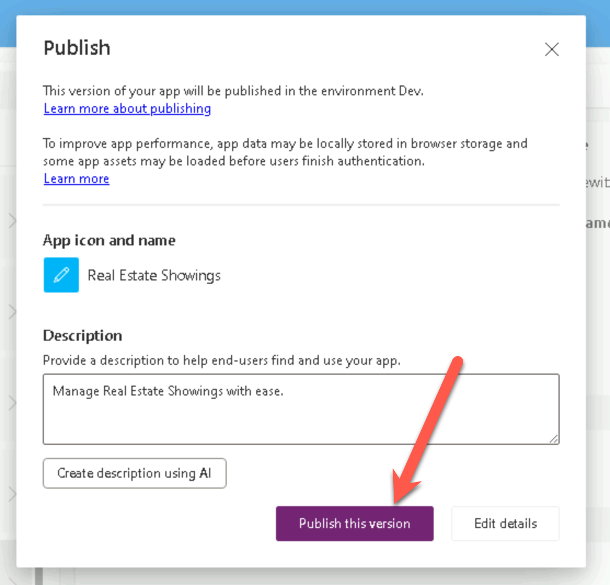

1. Exit the app to return to the Power Apps home page.

Congratulations! You have now created a Power Apps Canvas App with Copilot!

## ☑️ Task 3: Create a solution

In this task, you will create a solution for the components we just created via Copilot!

1. Go to [make.powerapps.com](https://make.powerapps.com/) and Sign In with your Power Apps credentials.

1. From the Power Apps home screen, select Solutions in the left navigation.

    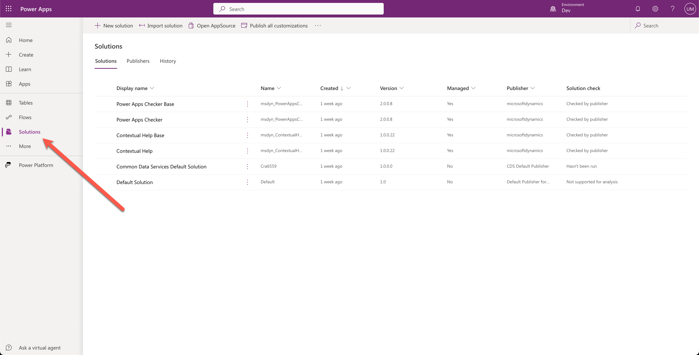

1. Select **+ New solution** at the top of the screen.

    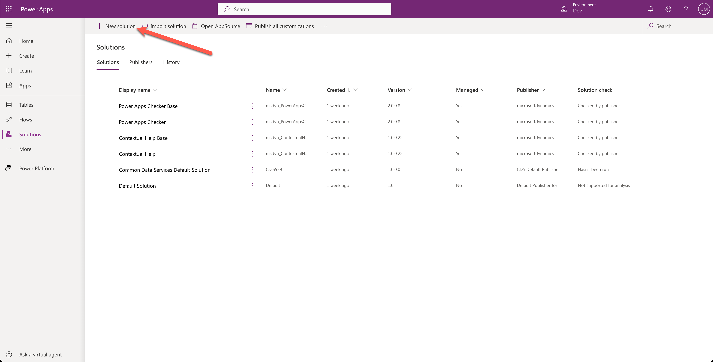

1. Add the solution name `MPPC 23` and select **+ New publisher**

    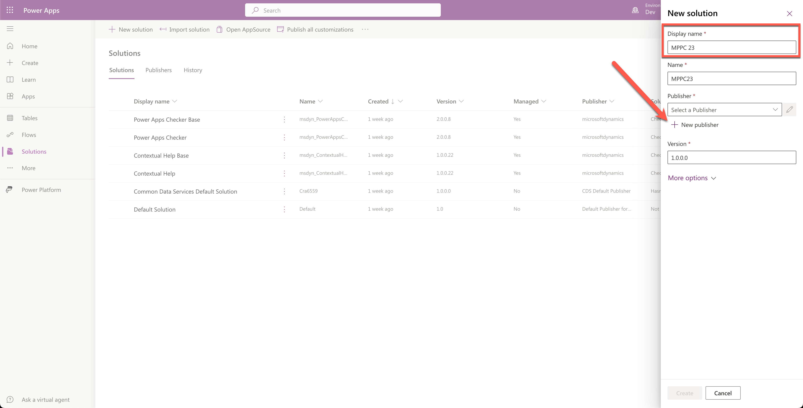

1. Add the `Display name`, `Name` and `Prefix`. Select **Save** when you're done.

    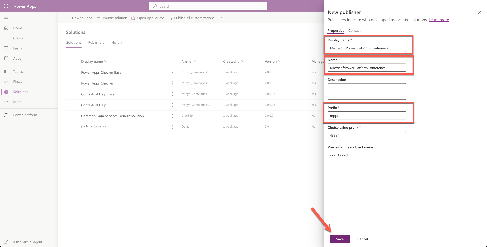

1. Select the newly created publisher from the `Publisher` dropdown.

    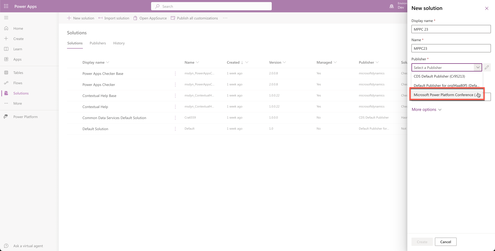

1. Select the **Create** button at the bottom.

    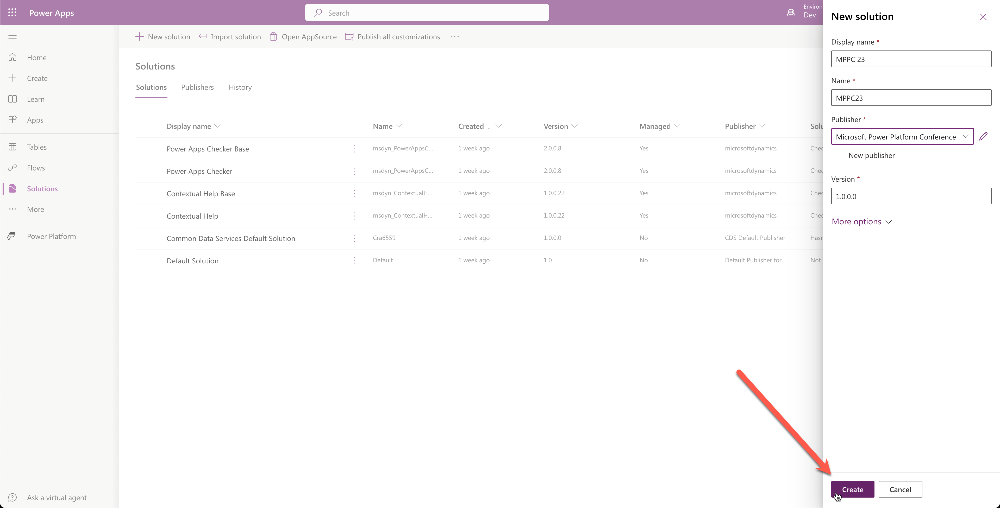

This concludes task 3, you have created the `MPPC 23` solution.

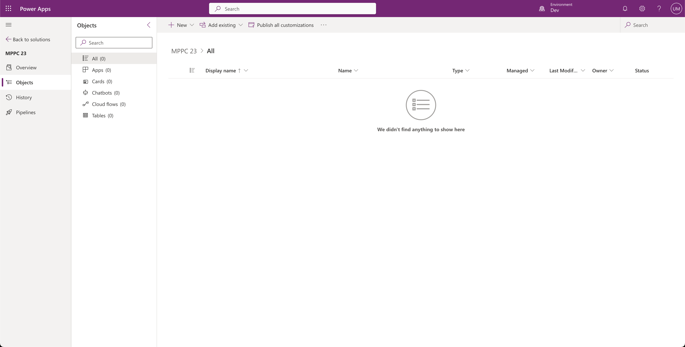

## ☑️ Task 4: Add the resources created by Power Apps Copilot to a solution

In this task, you will add the components we just created via Copilot to the `MPPC 23` solution!

1. Select **Add existing > App > Canvas app**

    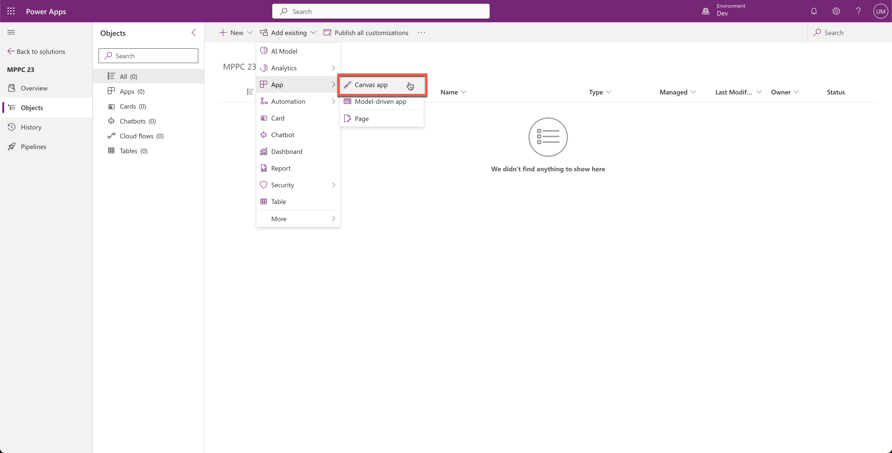

1. In the next screen select **All apps** by selecting the checkbox at arrow 1 and select the **Add** button at the bottom.

    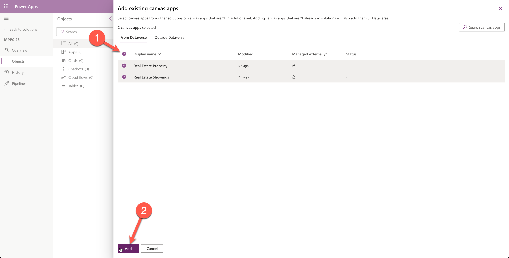

    This will add the canvas apps to the solution we just created. Next, we will add the Dataverse tables to the same solution.

1. Select **Add existing > Table**

    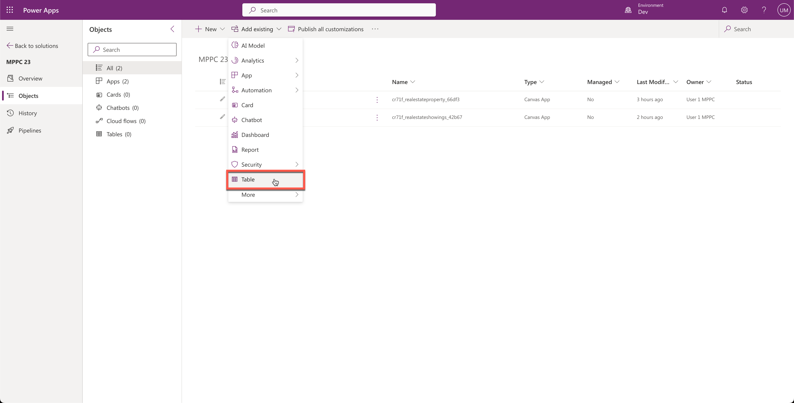

1. Search for `real` at the top right, this will filter the tables to only those that contain `Real` and will show only our tables, select the checkbox so that all tables are selected and select the **Next** button at the bottom.

    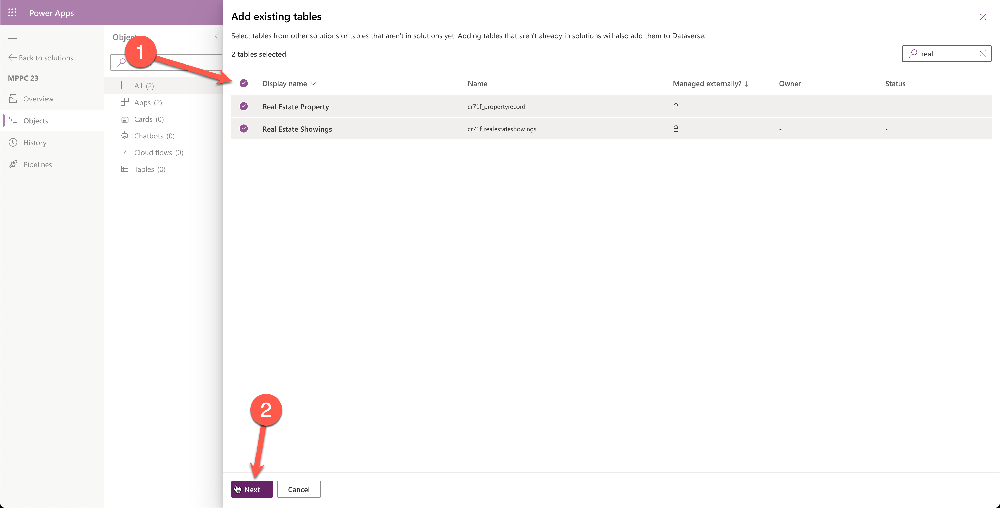

1. Select **Include all objects** at both tables and select the add button at the bottom.

    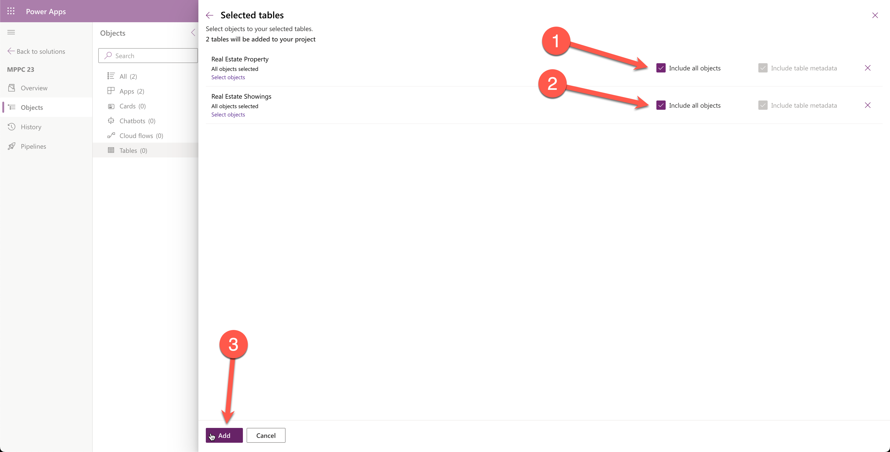

## Next lab

This is the end of lab 2. Select the third page below to move to the next lab.
