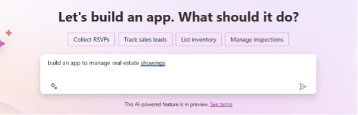
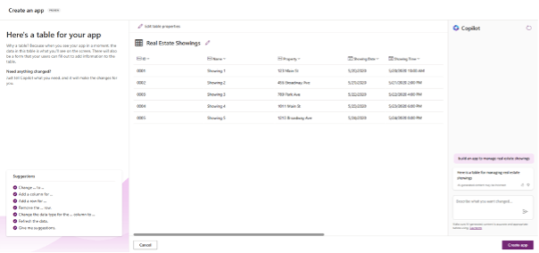
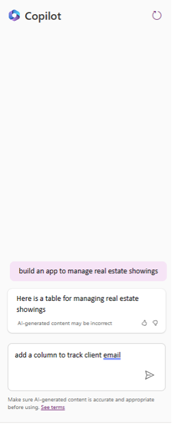
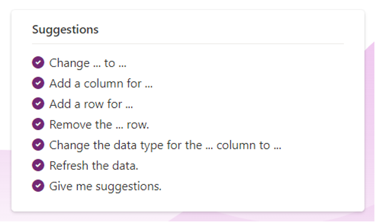

# 🚀 Lab 2: Develop

> [!IMPORTANT]
> This workshop is still work in progress for the time being.

This lab consists of two parts:

## Lab 2A: Develop

### Lab 2A - Tasks

In this lab, you will go though the following tasks:

- Creating a Canvas App with Power Apps Copilot
- Creating a solution
- Adding the created application to the solution

### Task 1: Create a Canvas App with Power Apps Copilot

In this task, you’ll create a mobile application leveraging Power Apps Copilot.  This app will be used by field agents to browse real estate inventory and manage appointments for showings and the data will be stored in Dataverse.

Before you begin, watch this video for a brief overview of what to expect when creating your first Power App with Copilot.

> [!NOTE]
> Power Apps requires either a Microsoft 365 license or a free trial. Learn more about your licensing options. [Microsoft products include Microsoft Power Apps and Power Automate](https://learn.microsoft.com/power-apps/administrator/pricing-billing-skus/).

#### EXPLORE AI COPILOT WITHIN POWER APPS

> [!NOTE]
> Within this lab, notice that your results for data may vary from those within the screenshots and images throughout the lab. This is because Power Apps is using OpenAI to generate data for the lab that changes daily.

1. In the center of the **Home** page within Power Apps, there's a text field in which you can enter a prompt to search for an AI generated table.  
  
1. Within the **text field** type the following prompt:
  
    ```text
    build an app to manage real estate showings
    ```

1. Then, select the **Send** button.

      

1. After the AI Copilot generates a table based on your prompt, look through the table to see what columns have been created for the start of your table.

    

    > [!NOTE]
    > If you'd like, you can add or modify the existing columns generated within the table by Copilot. But note that there is a pre-built Suggestions section to the left of the screen.

1. Let's explore further within modifying and adding to the already generated table.
1. In the text box, at the bottom of the **Copilot** pane to the right of the screen, type:

    ```text
    Add a column to track client email
    ```

1. Then, select the **Send** button.

    

1. Notice how a new column has been added to the table displaying the client’s email

    > [!NOTE]
    > Remember that the data that is generated in your table may vary from the data shown within the table in the screenshots and images for the lab.

    > [!NOTE]
    > In the bottom left corner of the screen, notice that there is a section titled Suggestions. This section provides you with different suggestions on how you can add to and modify your table.

    

## Lab 2B: Develop (APIM)

### Lab 2B - Tasks

In this lab, you will go though the following tasks:

- Open a local Web API in Visual Studio
- Add Connected Service for Power Platform
- Deploy the connector to Power Platform through Visual Studio ("MPPC" solution)
- Add connector to Copilot app created in Lab 02B

## Next lab

This is the end of lab 2, select the link below to move to the next lab.

[⏭️ Move to lab 3](../lab3/README.md)