# 🚀 Lab 2: Develop

> [!IMPORTANT]
> This workshop is still work in progress for the time being.

## 📝 Lab 2 - Tasks

In this lab, you will go though the following tasks:

- Creating a Canvas App with data from an Excel-file
- Creating a Canvas App with Power Apps Copilot
- Creating a reminder workflow with Power Automate Copilot
- Creating a solution
- Add the resources created by Power Apps Copilot to a solution

## ☑️ Task 1: Create a Canvas App with data from an Excel-file

In this unit, you’ll create a mobile application with data from an Excel table.

### Explore the Excel to Power App functionality

1. Go to [make.powerapps.com](https://make.powerapps.com) and select **Sign In** with your Power Apps account.
1. Download the Excel file you are using later by selecting the link [here](https://github.com/microsoft/MPPC23-Power-Apps/raw/main/lab2/resources/RealEstateProperties.xlsx).
1. From the Power Apps home screen, select **Start with data**.
           
1. Then select **Upload an Excel file**.
            
1. Click **Select from device** and navigate to the location where the **RealEstateProperties.xlsx** Excel file is saved and upload it. The maximum file size limit is 5 GB.
            
1. A table which is based on the data from the **RealEstateProperties.xlsx** Excel file will be generated. Click the pencil edit icon next to the table name to change it.
            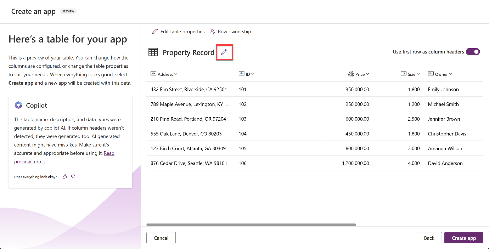
1. On the **Edit Table** pop up, enter `Real Estate Property` as the Display name, `Real Estate Properties` as the Plural Name, and make sure that `Address` is selected as the **Primary column**. Select **Save**.

    

1. Select the **Create app** button on the bottom right-hand corner of the screen.

    

1. When the app first loads, a dialog may appear saying: **Welcome to Power Apps Studio**. If so, select the **Skip** button.
1. You should now be viewing the app that has been generated for you in Edit mode.

    

1. To the left of the screen, select the **Data** icon from the navigation bar. Notice that a **Dataverse** table, based on the **RealEstateProperties.xlsx** Excel file, has been created.

    

1. Select the **Tree view** icon to return to the Tree view.

    

1. On the app main screen, click on the **gallery** displaying the **Real Estate Properties** and then click on **RecordsGallery1** in the **Tree view** to expand it.

    

1. Select the **ellipsis (…)** next to the **NextArrow** and delete it.

    

    This deletes the **NextArrow** icon on the gallery, so we have space to move the other gallery components around.

1. Select the **RecordsGallery1** and then select the edit button to put the gallery in edit mode.

    

1. Reduce the width and move the position of the **Address** title component so that it is towards the right-hand side of the template cell.

    

    The other components should reposition alongside the **Address** component. If not, then move them until it looks like the screenshot above.

1. Select the **RecordsGallery1** and then select the edit button to put the gallery in edit mode. Then click on **Insert** > search for *Image* > and then select the **Image** component.

    

1. The image will then be added to your gallery. Reposition and resize the image so that it is in the center of each gallery cell.

    

1. Make sure that the gallery is still in edit mode. Select the **subtitle**.

    

1. Set the **Text** value of the subtitle to the following formula:

    ```powerappsfl
    ThisItem.Size
    ```  

    

1. Using the tool bar at the top of the page, change the **Size** to **13**.

    

1. Now to use Power Apps Ideas, make sure the gallery is still in edit mode. And select the body containing the **Price**. Then click the lightbulb icon which appears above it.

    

1. Enter this output in the **Desired format** text box:

    ```powerappsfl
    $350,000
    ```

    Then press enter.

    

1. Select the generated formula. Then select **Apply**.

    

    With Power Apps Ideas,, the example ($350,000) which you gave generated a formula (Text(ThisItem.'Price (Base)', "$#,##0", "en-US")) which is now updated in the formula bar for the Price gallery control.

    You’ll also notice that the rest of the items in your gallery now apply the same formula.

1. Now let’s do the same for the **Size** control in the subtitle of the gallery. Make sure the gallery is in edit mode. And select the subtitle containing the **Size**. Then click the lightbulb icon which appears above it.
1. Enter this output in the **Desired format** text box:
    **Size: 1,800 sq ft**

    Then press Enter.

    You may notice that the ideas section is empty. This may be caused by the lack of information or context required to generate a formula.

    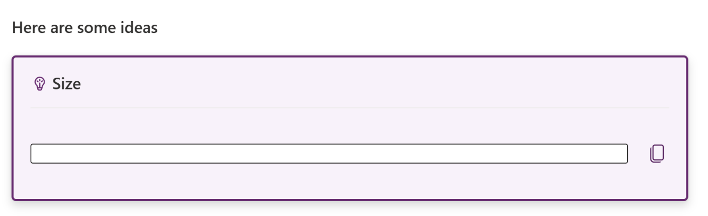

1. So, let’s add more examples. Click **+ Add examples** at least 2 more times.

    

1. Select 2 **Current formats** and then provide 2 corresponding **Desired formats**.

    

1. With the added context, Power Apps Ideas now generates a suitable formula for you:

    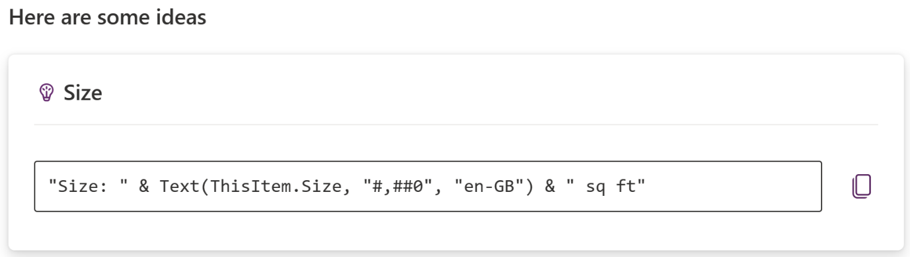

1. Select the generated formula. Then select **Apply**.

    Your gallery should now be looking like this:

    

1. **Save** the app.

1. Exit the app to return to the Power Apps home page.

    

## ☑️ Task 2: Create a Canvas App with Power Apps Copilot

In this task, you’ll create a mobile application leveraging Power Apps Copilot.  This app will be used by field agents to browse real estate inventory and manage appointments for showings and the data will be stored in Dataverse.

Before you begin, watch this video for a brief overview of what to expect when creating your first Power App with Copilot.

> [!NOTE]
> Power Apps requires either a Microsoft 365 license or a free trial. Learn more about your licensing options. [Microsoft products include Microsoft Power Apps and Power Automate](https://learn.microsoft.com/power-apps/administrator/pricing-billing-skus/).

### Explore AI Copilot within Power Apps

> [!NOTE]
> Within this lab, notice that your results for data may vary from those within the screenshots and images throughout the lab. This is because Power Apps is using OpenAI to generate data for the lab that changes daily.

1. In the center of the **Home** page within Power Apps, there's a text field in which you can enter a prompt to search for an AI generated table.  
  
1. Within the **text field** type the following prompt:
  
    ```text
    build an app to manage real estate showings
    ```

1. Then, select the **Send** button.

      

1. After the AI Copilot generates a table based on your prompt, look through the table to see what columns have been created for the start of your table.

    

    > [!NOTE]
    > If you'd like, you can add or modify the existing columns generated within the table by Copilot. But note that there is a pre-built Suggestions section to the left of the screen.

1. Let's explore further within modifying and adding to the already generated table.
1. In the text box, at the bottom of the **Copilot** pane to the right of the screen, type:

    ```text
    Add a column to track client email
    ```

1. Then, select the **Send** button.

    

1. Notice how a new column has been added to the table displaying the client’s email

    > [!NOTE]
    > Remember that the data that is generated in your table may vary from the data shown within the table in the screenshots and images for the lab.

    > [!NOTE]
    > In the bottom left corner of the screen, notice that there is a section titled Suggestions. This section provides you with different suggestions on how you can add to and modify your table.

    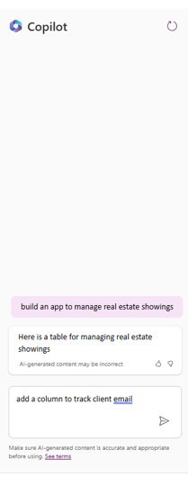

1. Notice that to the right of the screen, it appears to look as if you're having a conversation with a Copilot AI bot while adding to and modifying your table. Here's where you can scroll through and view the changes or additions you have made to your table.

    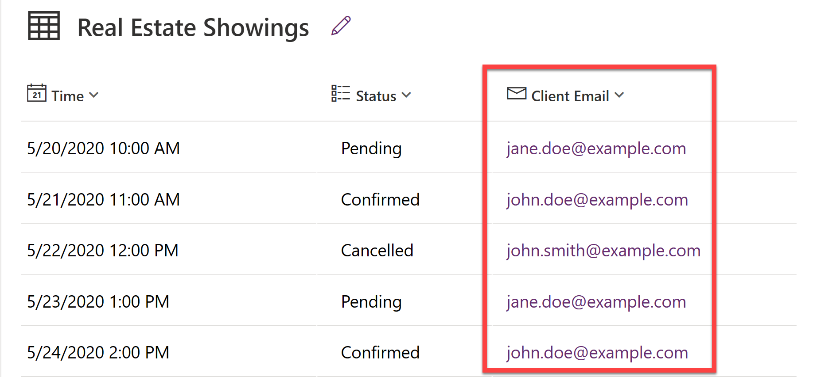

1. Now, let’s edit the **Status** column within the table. In the text box within the **Copilot** pane, type and send:

    ```text
    Add an option for “Completed” to the Status column
    ```

1. It may take a minute to load. Once it does, notice that the column name has been changed.

    

1. Select the **Status** column name **drop down**, and select **View column**. Here, you can view the columns’ properties and the current status details and data.

    

1. Select the **X** in the top right corner of the pane to close out.

    Let's try adding more data to our table and the existing columns.

1. Within the **Copilot** pane text box, type and send:

    ```text
    Add 5 more rows of data
    ```

1. Notice that five more rows of data are added for each of the existing columns within the table.

    

    Let's create the app now.

1. In the bottom right corner of the screen, select the Create app button.

    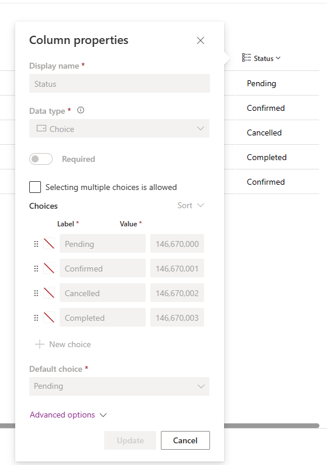

1. When the app first loads, a dialog may appear saying: Welcome to Power Apps Studio. If so, select the Skip button.

1. You should now be viewing the app that has been built for you in Edit mode.

    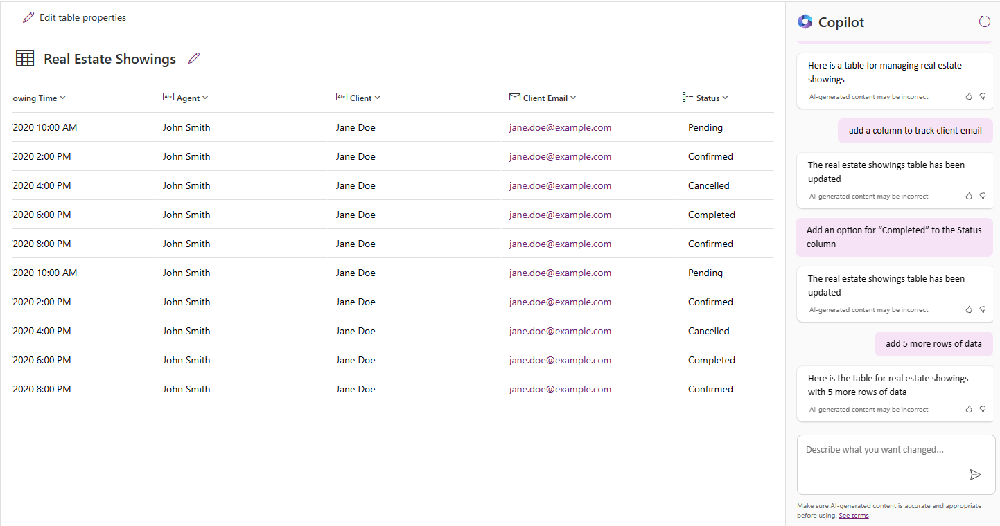

1. To the left of the screen, select the Data icon from the navigation bar. Notice that a Dataverse table has been created by the Copilot and is now in the Environments section.

    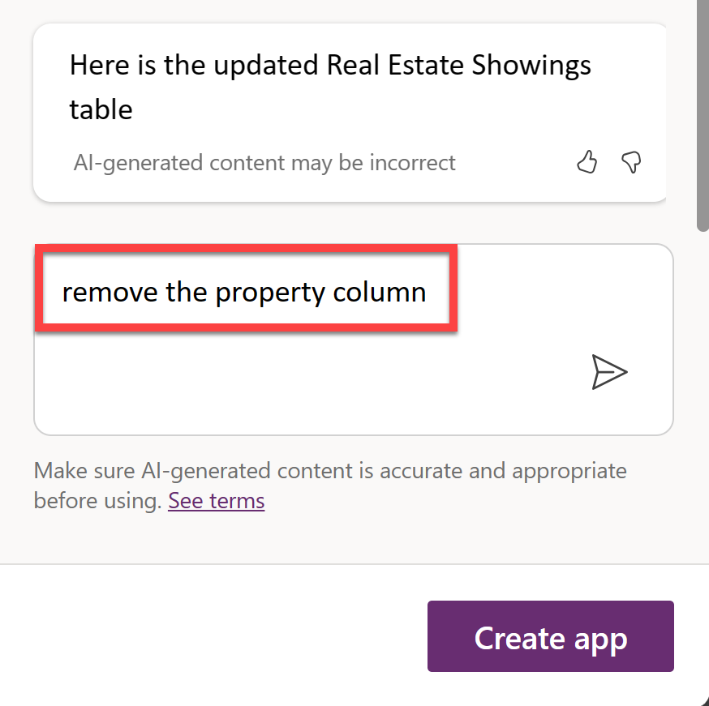

    > [!NOTE]
    > Copilot is currently only supported for Dataverse. You cannot use any other data access point at this time.

1. Let's try editing the table now that the app has been made.

1. Within the Data pane, hover over the table. To the right of the table, select the ellipsis (...).

1. From the menu, select Edit data.

    

1. The Edit Table dialog appears. Here's where you can come and add your own columns to the table, or modify existing columns.

    

1. Select the ID column header from the table.

1. From the drop-down, select the Edit column option.

    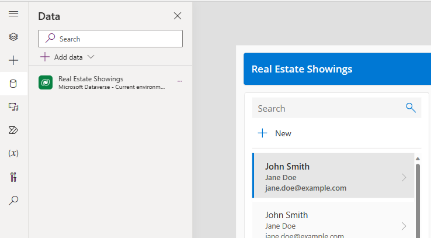

    In this example, we don't want the Data Type of the column to be a Single line of text. Let's change that.

1. Within the Edit column pane, from the Date type drop-down select # Autonumber

1. Select Save.

    

1. Select the Close button in the bottom right corner of the Edit table dialog.

1. Notice that the table now says Refreshed within the Data pane.

    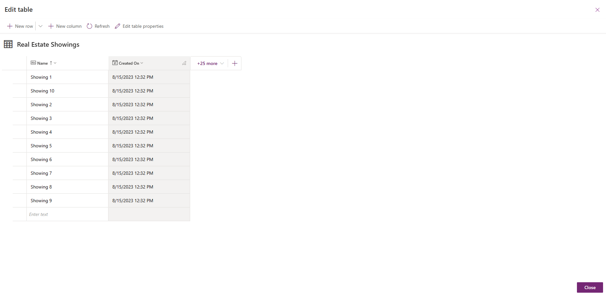

1. Now, let's make and add a new request to the table within the app.

1. From the top of the screen, select the Play button.

    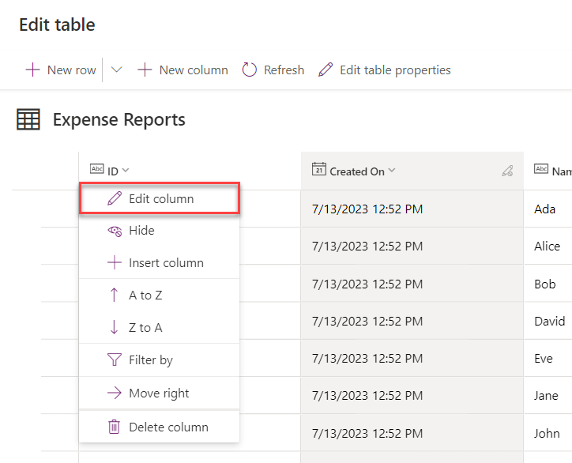

1. Within the pane to the left of the app, select the +New button.

    

1. Although you could modify the form to autofill the fields for you, we're going to do so ourselves to show that the app works.

1. Fill in the following fields with the information below:

1. Agent: `<Your name>`

1. Client: `<Your name>`

1. Client Email: `<Your name>`

1. Property: `<Any address>`

1. Showing Time: `<Any date>`

1. Status: `<Pending>`

1. Then, select the checkmark.

1. Now, select the X in the top right corner to close out of the app.

1. If a dialog appears saying: Did you know?, select OK.

1. Notice that the new request has been added to the list of requests to the left of the app.

1. From the top of your screen, select the Save button to save the new app you have created.

    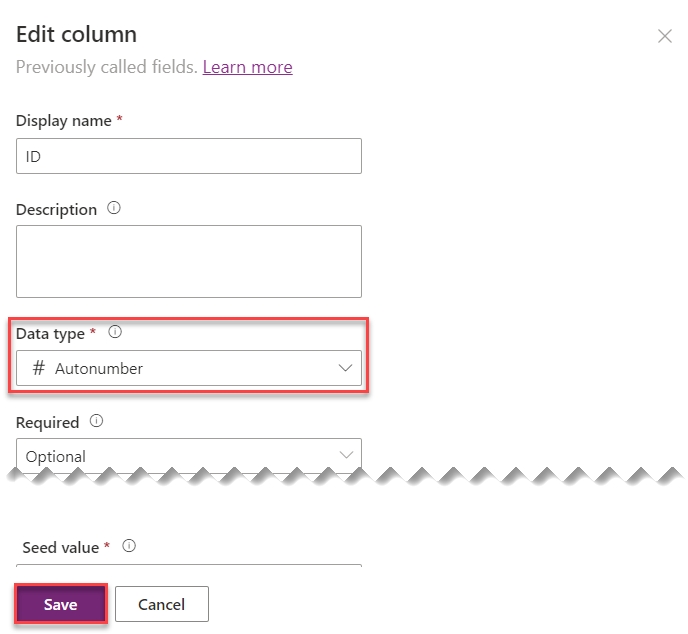

Congratulations! You have now created a Power Apps Canvas App with Copilot!

## ☑️ Task 3: Creating a reminder workflow with Power Automate Copilot

## ☑️ Task 4: Create a solution

TODO: Create a solution called "MPPC23".
TODO: Create another solution called "MPPC23 - Custom Connector"

## ☑️ Task 5: Add the resources created by Power Apps Copilot to a solution

TODO: Add the resources to the "MPPC23" solution.

## Next lab

This is the end of lab 2, select the link below to move to the next lab.

[⏭️ Move to lab 3](../lab3/README.md)
