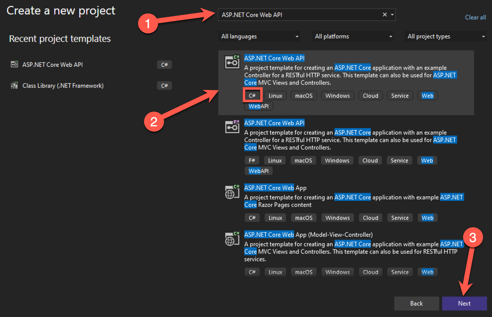
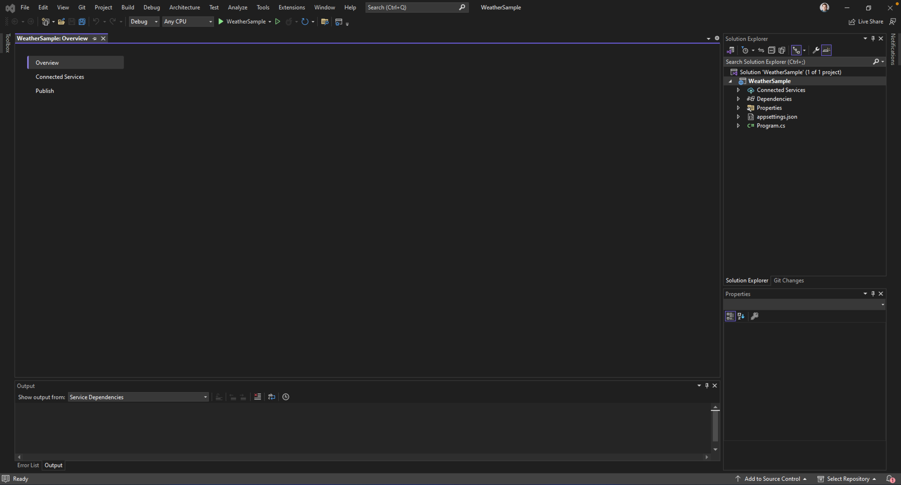
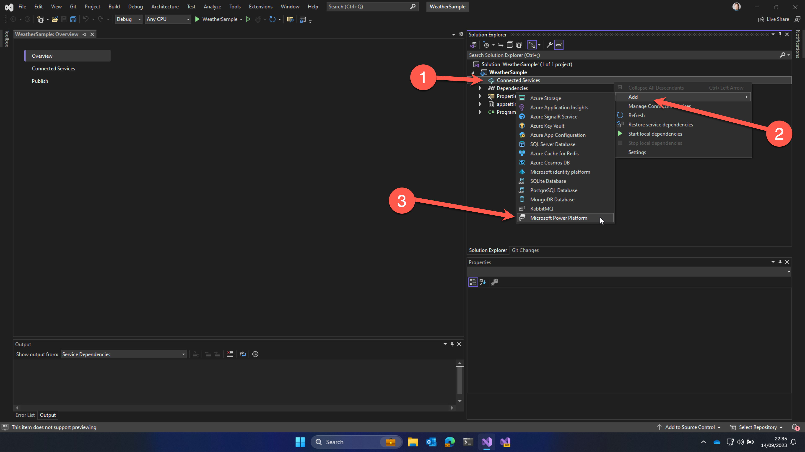

# 🚀 Lab 5: Connect your own WebAPI to your Power App

> [!IMPORTANT]
> This workshop is still work in progress for the time being.

> [!IMPORTANT]
> This lab is optional. Only do this one when you are finished with lab 1 - lab 4.

## 📝 Lab 5 - Tasks

In this lab, you will go though the following tasks:

- Create a local Web API in Visual Studio
- Add Connected Service for Power Platform
- Use the Connected Service for Power Platform to debug the connector
- Deploy the connector to Power Platform through Visual Studio
- Add connector to Copilot app created in Lab 02A
- Edit the Copilot created Power App and add the connector to it
- Test the app
- Remove the connector when done with testing
- Deploy the WebAPI to Azure
- Deploy the API to API Management
- Export the API to your Power Platform developer environment via API Management
- Edit the Copilot-created Power App again and add the connector exported from API Management to it
- Add the connector exported from API Management to the "MPPC23 - Custom Connector" solution

## ☑️ Task 1: Create a Web API in Visual Studio

In this task, we will create an ASP.NET project in Visual Studio.

1. Open Visual Studio 2022

1. Select **Create a new project**

    

1. Search for `ASP.NET Core Web API`, select the one that has C# in the tags and select **Next**

1. Enter the following details and select **Next**:

    Enter `WeatherSample` for the Project name

    Enter `C:\Dev` for the Location

1. In the next screen, select **Create**

This should create your ASP.NET Code Web API project and open it in Visual Studio 2022.

## ☑️ Task 2: Add Connected Service for Power Platform

In this task, you will add the Connected Service for Power Platform to your ASP.NET Code Web API project.

In the screen in Visual Studio where we left off at the end of task one, on the right, you can find the `Solution Explorer`

1. Right click Connected Services (1), select Add (2) & select Microsoft Power Platform (3)

    

## ☑️ Task 3: Use the Connected Service for Power Platform to debug the connector

## ☑️ Task 4: Deploy the connector to Power Platform through Visual Studio

## ☑️ Task 5: Add connector to Copilot app created in Lab 2A

## ☑️ Task 6: Edit the Copilot created Power App and add the connector to it

## ☑️ Task 7: Test the app

## ☑️ Task 8: Remove the connector when done with testing

## ☑️ Task 9: Deploy the WebAPI to Azure

## ☑️ Task 10: Deploy the API to API Management

## ☑️ Task 11: Export the API to your Power Platform developer environment via API Management

## ☑️ Task 12: Edit the Copilot-created Power App again and add the connector exported from API Management to it

## ☑️ Task 13: Add the connector exported from API Management to the "MPPC23 - Custom Connector" solution

## End of labs

This is the end of the optional lab 5 and the workshop, select the link below to move back to the workshop readme.

[⏭️ Move to the workshop readme](../README.md)
